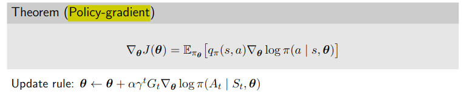

## Task 4

### Task 4b

$$ \begin{align} v_\pi(s) &= \sum_{a} \pi(a|s) \sum_{s',r} p(s',r|s,a)\left[r + \gamma v_\pi(s')\right] \qquad \forall \: s \in \mathcal{S} \\
&= \sum_{s',r} p(s',r|s)\left[r + \gamma v_\pi(s')\right]  \\
&= \sum_{s',r} p(s',r|s)\left[r + \gamma \max_a v_\pi(s') \right] \\
v_*(s) &= \max_a \sum_{s',r} p(s',r|s)\left[r + \gamma v_*(s')\right] 
\end{align}$$

## Task 8

### Task 8a

First visit MC value estimates

$$ \begin{align} V(s) \leftarrow V(s) + \frac{1}{n(s) + 1} [G_t - V(s)] \end{align} $$

## Task 9

### Task 9c

Softmax policy, Start $S=1$, $G_0 = 5$ after $a = 1$, $\gamma = 1$, $\alpha = 1$

Softmax is
$$ \pi(a|s) = \frac{e^{\phi(s,a)^T \theta}}{\sum_{b} e^{\phi(s,b)^T \theta}} $$

Score is
$$
\nabla_\theta \log \pi(a|s) = \phi(s,a) - \mathbb{E}_{\pi}[\phi(s,\cdot)]
$$

<!-- \nabla_\theta \log \pi(a|s) = \frac{(a - \mu(s)) \phi(s,a)}{\sigma^2(s)} -->

Update 
