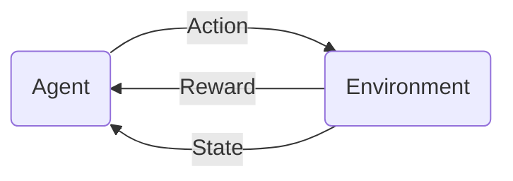

## General Information

Tutor: Vinh Tong

One strike is fine, probabilistic its unlikely to be spotted.

## Theory

Interaction loop for RL

### Exploration vs Exploitation

* Without Exploration: Policy $\pi$ is random (can be bad)
* Without Exploitation: Doesn't use the knowledge one has obtained

## Upper Confidence Bound (UCB)

$$ UCB(a) = Q(a) + c\sqrt{\frac{\log(t)}{N_a}}$$
